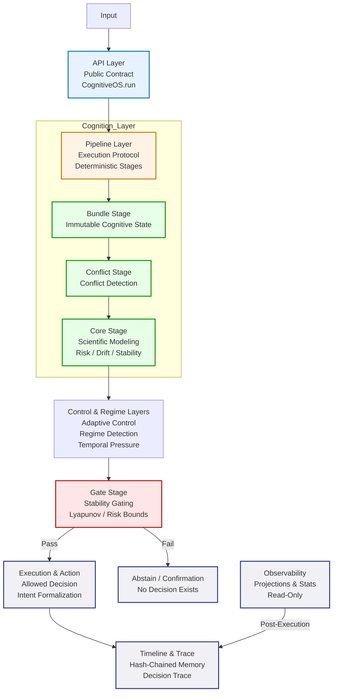

# ARVIS Architecture

## Overview

ARVIS is a **layered cognitive system architecture** designed to enforce:

* deterministic reasoning
* stability-constrained decision-making
* full traceability of cognitive execution

It is not a model architecture.

It is a **constraint architecture**, where cognition is structured, evaluated, and gated before any decision is allowed to exist.

---

## Architectural Model

ARVIS is structured as a **strictly layered system**:

```text
API Layer
↓
Pipeline Layer (Execution Protocol)
↓
Cognition Layer (State Construction)
↓
Core Layer (Scientific Modeling)
↓
Mathematical Layer (Signals & Stability)
↓
Kernel Layer (Invariants & Guarantees)
```

Each layer has **strict responsibilities** and cannot bypass the others.

ARVIS is structured as a **strictly layered system**:



---

## Core Principle

> ARVIS does not generate decisions.
> It determines whether a decision is **allowed to exist under constraints**.

---

## Layer-by-Layer Specification

---

### 1. API Layer

**Role:** External interface

* exposes `CognitiveOS`
* returns stable, versioned outputs
* hides internal complexity

**Key properties:**

* contract-based output
* versioned serialization
* no access to internal execution

---

### 2. Pipeline Layer (Execution Protocol)

**Role:** Deterministic orchestration

* enforces ordered execution
* coordinates all cognitive stages
* ensures fail-safe execution

**Key properties:**

* fixed stage sequence
* no implicit branching
* fail-soft execution (`_safe_run`)

The pipeline is the **only place where cognition is allowed to evolve over time**.

---

### 3. Cognition Layer (State Construction)

**Role:** Build structured cognitive state

Main component:

```python
CognitiveBundleBuilder
```

**Guarantees:**

* no reasoning
* no execution
* deterministic construction

The bundle is:

> a **pure snapshot of cognitive state**

It aggregates:

* decision context
* introspection
* explanation
* timeline
* memory
* retrieval signals

This layer ensures that:

> all downstream reasoning operates on a **fully explicit, immutable state**

---

### 4. Core Layer (Scientific Modeling)

**Role:** Compute system dynamics

Main component:

```python
CognitiveCoreEngine
```

The core:

* does not decide
* does not control execution
* does not apply constraints

It only computes:

* collapse risk
* drift (`dv`)
* optional reflexive signals

Output:

```python
CognitiveCoreResult
```

This is:

> a **pure scientific measurement of system state**

---

### 5. Mathematical Layer (Signals & Stability)

**Role:** Provide formal primitives

Includes:

* RiskSignal
* DriftSignal
* StabilitySignal
* ConflictSignal

**Properties:**

* normalized [0,1]
* immutable
* type-safe
* float-compatible (controlled coercion)

This layer ensures:

> no raw scalar can influence cognition without semantic constraints

---

### 6. Kernel Layer (Invariants & Guarantees)

**Role:** Enforce global system correctness

Example:

```python
assert_kernel_invariants(bundle)
```

Ensures:

* bounded stability values
* consistency between reasoning components

This layer defines:

> what is structurally valid cognition

---

## Critical Architectural Separations

---

### 1. State vs Computation

* Bundle → state
* Core → computation
* Pipeline → orchestration

No component mixes these responsibilities.

---

### 2. Cognition vs Observability

* cognition produces state
* observability projects state

Observability:

* is read-only
* has no influence on decisions

---

### 3. Decision vs Execution

* decision is evaluated early
* execution is gated later

No decision is directly executable.

---

### 4. Signals vs Scalars

* all critical values are signals
* raw floats are controlled and wrapped

---

## Stability as a First-Class Constraint

In ARVIS:

* stability is not evaluated after decision
* stability is not advisory

It is **structural**.

The Gate stage ensures:

* unstable systems cannot act
* high-risk states are blocked
* uncertainty triggers confirmation

A decision:

> exists only if it passes stability constraints

---

## Determinism Model

The system guarantees:

* fixed execution order
* explicit state transitions
* no hidden mutation
* identical inputs → identical outputs

This makes ARVIS:

* replayable
* auditable
* verifiable

---

## Replayability

Through:

* timeline snapshots
* bundle reconstruction (`from_timeline`)

ARVIS supports:

* deterministic replay
* simulation
* forensic analysis

---

## Architectural Guarantees

ARVIS enforces:

* no implicit reasoning
* no uncontrolled side effects
* no unbounded values
* no direct action without validation
* full traceability of decisions

---

## Summary

ARVIS is not a framework.

It is a **cognitive constraint system** where:

* state is explicit
* computation is isolated
* control is deterministic
* stability is enforced
* decisions are gated

A cognitive process is not executed.

It is:

> constructed → evaluated → constrained → allowed
