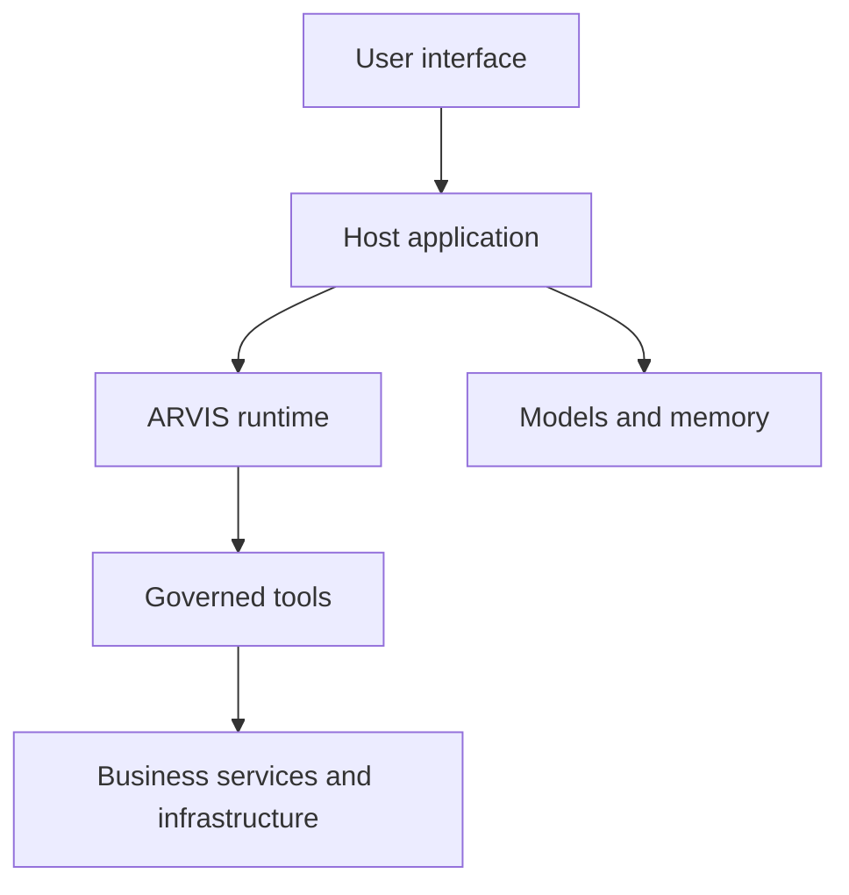
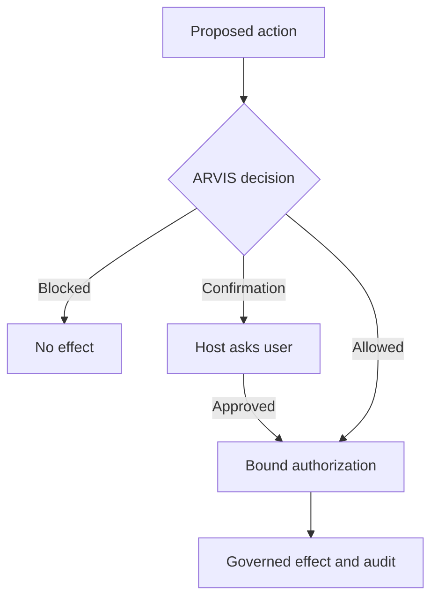

# Reference architecture: sovereign, governed AI assistant

This document shows where ARVIS fits in a complete assistant application. It is
an implementation-neutral reference architecture inspired by integration
patterns used in VeraMem; it is not a required deployment topology and does
not make VeraMem a dependency of ARVIS.

The central idea is simple:

> ARVIS is the governance boundary between AI-generated intentions and effects
> that an application may allow to happen.

ARVIS is not the user interface, the identity provider, the LLM, the retrieval
system, the business database or the message broker. Those remain host
responsibilities.

## System boundary

| Layer | Owns | Does not delegate to ARVIS |
| --- | --- | --- |
| User interface | conversation, rendering, confirmation prompts | identity, consent or policy truth |
| Host application | authentication, tenants/spaces, business context, orchestration | the authority to bypass a blocked effect |
| ARVIS | decision admissibility, policy composition, confirmation binding, effect authorization, trace and commitments | storage, model quality or business credentials |
| Models and memory | generation, embeddings, retrieval, application knowledge | authority to execute an effect |
| Governed tools | typed boundary around reads and effects | mutable pipeline context or caller-owned payloads |
| Business infrastructure | databases, queues, object stores, external APIs, observability | ARVIS-internal decision state |

The host can replace any concrete model, database or queue without changing
this separation of responsibilities.

## Two planes

The architecture is easier to reason about when it is split into two planes.

### Cognition and data plane

The host gathers the user's request, authenticated identity, tenant or space,
retrieved context and model output. It gives ARVIS only the structured material
needed for a governed turn. Retrieval and generation can happen locally or
through a declared external provider.

### Authority and effect plane

A model may propose an action, but a proposal carries no authority. ARVIS
evaluates the request, records the decision and authorizes an external effect
only through the governed syscall path. The host supplies real identity,
consent, durable audit and business adapters.

An application must never interpret “the model asked for a tool” as permission
to call that tool directly.

## Reference request: retrieve, summarize, send

This scenario makes the separation concrete.

1. A user asks the assistant to find a document.
2. The host authenticates the user and resolves the active personal or
   organizational space.
3. A read-only search adapter retrieves authorized passages.
4. A model prepares a summary. The model output is data, not authority.
5. The user asks to send the summary to an external recipient.
6. The host resolves the recipient and builds a typed tool request.
7. ARVIS distinguishes the outbound, side-effectful action from the earlier
   read and applies the configured risk, consent and confirmation policies.
8. If confirmation is required, the host displays the exact action and bound
   payload. Rejection or expiry ends the path.
9. After a valid confirmation, the governed syscall path freezes the payload,
   binds identity and tenant context, persists an intent and activates a
   single-use capability.
10. The adapter performs the effect and ARVIS binds its result to the audited
    intent.

The normative internal sequence is specified in
[EFFECT_PATH.md](EFFECT_PATH.md). The runnable
[`11_governed_assistant.py`](../../examples/11_governed_assistant.py) example
intentionally stops at the decision boundary: it registers and freezes tools,
then shows an allowed read and a send awaiting confirmation. It does not teach
an application to call `tool.execute()` outside the syscall path.

## Host integration contract

A minimal host should:

- create one ARVIS engine per governed turn;
- build identity and tenant context from a trusted channel, never from model
  output;
- register tool specifications during bootstrap and freeze the registry before
  handling requests;
- treat `DecisionStatus` as the public verdict;
- preserve the exported IR and external commitment when auditability matters;
- route every side effect through the governed effect path;
- provide purpose-scoped consent and egress gates for connected tools;
- use a durable audit sink and authenticated principal in production;
- keep credentials and live clients outside canonical effect material;
- define rollback, retry and idempotency at the host boundary.

See [RUNTIME_LIFECYCLE.md](RUNTIME_LIFECYCLE.md) for instance ownership and
[the tool authoring guide](../tools/TOOL_AUTHORING_GUIDE.md) for adapter rules.

## Deployment choices

ARVIS does not require a particular stack. These are examples, not conceptual
dependencies:

| Capability | Local/self-hosted option | Managed option |
| --- | --- | --- |
| Generation | Ollama or another local runtime | a declared model provider |
| Relational state | PostgreSQL or SQLite for development | managed SQL |
| Vector search | Qdrant or another vector store | managed vector service |
| Async work | RabbitMQ or another broker | managed queue |
| Object storage | encrypted local/object storage | managed object storage |
| Telemetry | local OpenTelemetry-compatible collector | managed observability |

The sovereignty claim belongs to the complete host deployment, not to ARVIS
alone. A locally installed kernel does not make an application sovereign if its
data is sent to undeclared external services.

## What this architecture does not provide

This reference does not ship:

- an authentication or authorization product;
- a RAG pipeline;
- a distributed tool registry;
- durable confirmation or idempotency storage;
- production credentials or provider configuration;
- a complete Docker composition;
- a replacement for threat modelling and operational controls.

It is a map for integrating the kernel correctly, not a second application
distribution.

## Concrete integration pattern

[VeraMem integration pattern](../integration/VERAMEM_INTEGRATION_PATTERN.md) shows
how a real assistant can instantiate these roles while keeping its product
services and infrastructure outside ARVIS.
