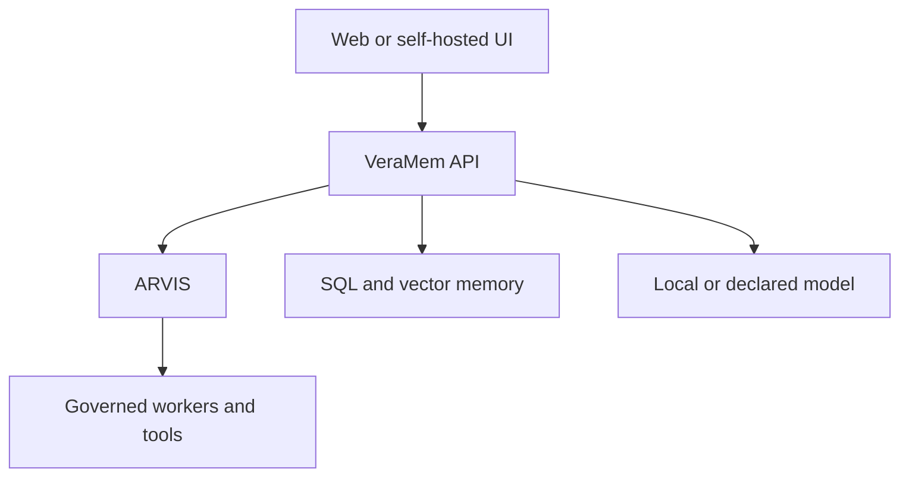

# Integration pattern: applying the reference architecture in VeraMem

VeraMem is the author's own host application for ARVIS, not an independent
adoption: read this as an illustrative integration pattern, not as a case
study with deployment evidence (it deliberately contains no dates, scale,
metrics or incident history). It explains the architectural relationship at
a high level so an integrator can project ARVIS into a real system. It is
descriptive, not a public contract for VeraMem, and does not expose
production configuration, credentials or proprietary business logic.

Read the generic
[governed-assistant reference architecture](../architecture/REFERENCE_ASSISTANT_ARCHITECTURE.md)
first.

## Responsibility split

| VeraMem host responsibility | ARVIS responsibility |
| --- | --- |
| user identity, sessions and personal/organization spaces | validate the trusted identity material presented to an effect |
| document ingestion, OCR, metadata and access rules | govern whether a proposed operation may proceed |
| relational and vector persistence | emit canonical IR and commitments |
| retrieval and prompt/context assembly | compose policy, uncertainty and admissibility signals |
| model-provider selection and credentials | treat model output as untrusted proposal data |
| queues, workers, retries and crash recovery | bind an authorized payload to a single-use capability |
| consent UI and recipient resolution | require and bind confirmation where policy demands it |
| business tools and external connectors | enforce the governed syscall and audit sequence |

VeraMem remains the product and integration layer. ARVIS remains the
application-independent governance kernel.

## Illustrative topology

Concrete technologies can include PostgreSQL, Qdrant, RabbitMQ and a local
model runtime such as Ollama. They are VeraMem deployment choices, not ARVIS
requirements.

## Example flow

Consider a user asking:

> Find the latest contract note, summarize the termination clause and send it
> to the counsel working on this matter.

VeraMem:

1. authenticates the user and selects the active matter or space;
2. applies document access rules before retrieval;
3. retrieves source passages and constructs model context;
4. resolves the intended recipient through trusted application data;
5. translates the proposed send into a typed tool request;
6. displays any ARVIS-required confirmation with the exact recipient and
   bounded content;
7. supplies the durable audit and idempotency infrastructure used by the
   governed effect.

ARVIS:

1. governs the structured decision;
2. distinguishes the read-only retrieval from outbound data egress;
3. refuses malformed or unsupported inputs fail-closed;
4. binds the authenticated principal, tenant/space and payload;
5. prevents execution until policy and confirmation conditions hold;
6. returns the decision, trace, IR and commitment needed for audit or replay.

The LLM never receives authority to send the message. The connector never
receives mutable cognition state. The product host never receives a sanctioned
shortcut around the effect path.

## Why publish this pattern

ARVIS is intentionally abstract. VeraMem demonstrates that its boundaries map
onto familiar product concerns:

- a memory system remains responsible for retrieval and storage;
- a model remains responsible for generation;
- an application remains responsible for users, spaces and business rules;
- ARVIS governs the transition from proposal to allowed effect.

This makes the kernel easier to adopt without coupling it to one database,
model provider or product.

## Relationship to a future self-hosted edition

A planned self-hosted VeraMem edition can package the application pieces that
ARVIS deliberately does not provide: UI, accounts, spaces, memory, deployment
configuration and ready-made connectors. ARVIS remains independently useful
for developers who want to build a different host.

This creates two distinct adoption paths:

1. use ARVIS directly as a Python governance kernel;
2. use VeraMem as a more integrated assistant product built around it.

Neither path changes the security boundary: production identity, durable audit,
consent, provider configuration and operational recovery remain explicit host
obligations.

## Deliberate omissions

This document does not publish:

- VeraMem production endpoints or network topology;
- secrets, certificate policy or deployment credentials;
- database schemas or tenant-isolation implementation details;
- proprietary ranking, prompt or product logic;
- a production-ready compose file.

Those details are unnecessary to understand where ARVIS fits and would turn a
reference architecture into an accidental second VeraMem distribution.
